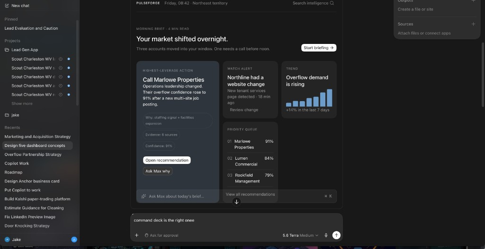

# SPEC-006 — Pulseforge Command Deck

| Field | Value |
|---|---|
| **Status** | Approved |
| **Target Version** | v1.0.0 |
| **Priority** | Highest |
| **Owner** | TBD |
| **Created** | 2026-07-26 |

## Objective

Build the world's first intelligence-first outbound workspace.

Pulseforge is not a CRM. Pulseforge is not a chatbot. Pulseforge is an **Intelligence Operating System**.

Every morning the operator should feel like they're walking onto the bridge of a ship. Before they ask a question—Pulseforge already knows what matters.

**Definition of Done:** Pulseforge v1.0 is complete when an operator can open the application, understand the current state of their market in under 30 seconds, investigate any recommendation through a contextual conversation with Max, inspect the complete evidence chain behind every conclusion, and confidently decide what to do next—without feeling like they are navigating a traditional CRM.

## Vision References

- `docs/vision/Product_Constitution.md` (§11 Cognitive load)
- `docs/vision/Product_Experience.md`
- `docs/vision/Intelligence_Architecture.md`
- `docs/vision/Product_Roadmap.md`
- [SPEC-002](SPEC-002_Max_Reasoning_Engine.md)
- [SPEC-003](SPEC-003_Temporal_Intelligence_Memory.md)
- [SPEC-004](SPEC-004_Max_Briefing_Engine.md)
- [SPEC-005](SPEC-005_Policy_Decision_Engine.md)
- [ADR-001](../adr/ADR-001_Conversation_First.md)
- [ADR-002](../adr/ADR-002_Explainable_AI.md)

## Mission

When an operator opens Pulseforge, they should feel that the system has already done the thinking. Their job is no longer to find information—it is to make informed decisions.

## Product Principles

### 1. Intelligence Before Interaction

The operator should never need to ask: *What's happening?*

The Command Deck answers first.

### 2. Conversation Is For Exploration

Chat is not navigation. Chat is investigation.

The dashboard delivers conclusions. Max explains them.

### 3. Reduce Cognitive Load

Every screen must answer: *What deserves my attention?*

Everything else is secondary.

### 4. Explain Everything

Every recommendation must expose:

- Why
- Why not
- Evidence
- History
- Confidence
- Policy

No black boxes.

## Problem

The intelligence stack (Knowledge → Reasoning → Memory → Briefing → Policy) already produces structured conclusions. Operators still land on CRM-shaped surfaces: metrics walls, account lists, and blank chat. Nothing consumes the stack as a morning bridge experience.

## Scope

- Command Deck landing experience (Morning Brief)
- Highest Leverage Action card
- Secondary intelligence cards (Watch Alert, Trend, Risks, Market Movement)
- Priority Queue (intelligence ranking with movement)
- Ask Max launcher (pinned) + contextual Ask Max modal / Intelligence Workspace
- Company Intelligence page
- Recommendation Detail page (full explainability)
- Intelligence-first navigation
- Consume Briefing / Reasoning / Memory / Policy domain objects without recreating them
- Fail-closed runtime; no changes to deterministic reasoning

## Out of Scope

- Recreating Knowledge / Reasoning / Memory / Briefing / Policy logic in the UI
- Autonomous outbound execution
- Replacing setter/closer human roles
- Pixel-perfect reproduction of the reference mockup
- New scoring or policy rules (use existing engines)

## Dependencies

- ✅ SPEC-002 Max Reasoning Engine (v0.8.0)
- ✅ SPEC-003 Temporal Intelligence & Memory (v0.8.1)
- ✅ SPEC-004 Max Briefing Engine (v0.9.0)
- ✅ SPEC-005 Policy & Decision Engine (v0.9.1)
- Shadow or live wiring of `max.brief()` / `max.decide()` into the operator surface (implementation slice)

## Architecture

```text
Knowledge
      │
Reasoning
      │
Memory
      │
Briefing
      │
Policy
      │
────────────────────
Command Deck
────────────────────
      │
Ask Max Modal
```

**Notice:** The dashboard consumes the stack. It never recreates it.

## Visual Direction (Reference)

The attached mockup is the current reference direction for the Command Deck. Implementation should preserve the overall information hierarchy, restraint, and visual philosophy rather than matching pixels exactly.



Design goals (inspired by Apple, Linear, Arc, Cursor, Stripe, Bloomberg Terminal, Mission Control):

- Quiet · Premium · Focused · Confident · Zero clutter

Motion should feel alive but restrained: cards gently update, watch alerts pulse once, recommendation movements animate subtly. Never flashy. Never distracting.

## Landing Experience

When Pulseforge opens:

- No loading dashboard
- No metrics wall
- No CRM

Instead:

```text
Friday · 8:42

Good morning.

Your market shifted overnight.

Three companies entered your opportunity window.

One requires attention before noon.
```

Immediately underneath: **Highest Leverage Action** — large, beautiful, impossible to miss.

### Highest Leverage Action (example)

```text
Call Marlowe Properties

Opportunity 91
Confidence 94
↑ +12 this week

Supporting Signals
✓ Staffing expansion
✓ Multi-site growth
✓ Operations leadership change

6 Evidence Sources

[ Review Recommendation ]
```

This card should dominate the page.

### Secondary Intelligence Cards

Small. Calm. Supporting.

Examples:

| Card | Example |
|---|---|
| Watch Alert | Northline added new tenant services · 18 minutes ago |
| Trend | Overflow demand ↑14% · Past seven days |
| Risks | Two opportunities lost confidence |
| Market Movement | Three hiring signals detected |

### Priority Queue

Not a CRM list. An intelligence ranking.

```text
01 Marlowe        ↑4     Opportunity 91 · Confidence 94
02 Lumen          —      Opportunity 84 · Confidence 89
03 Rookfield      ↓1     Opportunity 79 · Confidence 96
```

Movement is mandatory. Memory should be visible.

### Bottom Interaction

Pinned permanently. Minimal. Elegant.

```text
Ask Max...
```

Not a full chat. Not intrusive. Clicking opens the Intelligence Workspace.

## Ask Max Modal

The background fades. The workspace expands.

Not a side panel. Not a drawer. A focused environment.

### Initial State

Max already understands context. If opened from Command Deck:

```text
Good morning.

You're reviewing today's briefing.

Three opportunities improved overnight.

One watch alert triggered.

What would you like to investigate?
```

Suggested actions:

- Why is Marlowe #1?
- Show overnight changes
- Explain confidence
- Compare top opportunities
- Show overflow companies

No blank page.

### Context Awareness

| Opened from | Max already knows |
|---|---|
| Company page | The company |
| Recommendation | The recommendation |
| Timeline | The timeline |

Never require the operator to repeat context.

### Conversation Philosophy

Max never guesses. Every answer comes from:

```text
Knowledge → Reasoning → Memory → Policy
```

The LLM translates. It never invents.

## Progressive Disclosure

```text
Dashboard → Recommendation → Ask Max → Evidence → Raw interactions
```

Each level reveals more detail. Never overwhelm the operator.

## Company Intelligence Page

Every company receives its own intelligence workspace.

Sections: Overview · Reasoning · Memory · Timeline · Evidence · Interactions · Policy · Recommendations

Not CRM fields. Intelligence.

## Recommendation Detail

Every recommendation expands into:

- Opportunity
- Confidence
- Trend
- Supporting Signals
- Contradicting Signals
- Evidence
- History
- Policy Evaluation
- Audit Trail
- Related Companies
- Ask Max About This Recommendation

## Navigation

Navigation reflects operator intent:

```text
Command Deck · Recommendations · Companies · Market · Timeline · Ask Max · Settings
```

Not: Accounts · Contacts · Activities · Tasks · Reports

## Empty States

Even with zero prospects, Max should still brief:

```text
Good morning.

No priority opportunities today.

Scout completed successfully.

No watch alerts triggered.

Suggested focus:

Continue market discovery.
```

The application should never feel empty.

## Performance

| Interaction | Target |
|---|---|
| Initial load | < 1 second |
| Recommendation expansion | < 250 ms |
| Ask Max modal | Instant |
| Conversation context | Preloaded |

## Data Model

Command Deck is a **presentation consumer**. It does not own new intelligence tables.

Primary contracts (from existing packages):

- `max.brief({ tenantId, asOf, period })` → Morning Brief, priorities, watch alerts, risks, changes
- Reasoning recommendations → Priority Queue + Highest Leverage Action
- Memory diffs / watches → Watch Alerts + movement indicators
- `max.decide()` / Policy audit → Recommendation Detail policy evaluation + audit trail

UI may persist only presentation preferences (theme, collapsed sections, last Ask Max context id)—never duplicate domain truth.

## Implementation Plan

1. **Constitution + docs** — §11 cognitive load; roadmap / CURRENT_STATE point at SPEC-006
2. **Command Deck shell** — intelligence-first nav; Morning Brief layout; empty states
3. **Briefing wiring** — power Morning Brief, HLA card, secondary cards from `max.brief()`
4. **Priority Queue** — Reasoning + Memory movement; fail-closed when stack unavailable
5. **Recommendation Detail** — full explainability chain including Policy
6. **Company Intelligence page** — sections listed above; no CRM field dump
7. **Ask Max modal** — context injection from page; suggested actions; LLM as translator only
8. **Performance pass** — meet load / expansion / modal targets; preload conversation context

## Migration Strategy

- Ship behind feature flag / route (e.g. `/command-deck`) while existing `/dashboard` remains available
- Default-off for production tenants until acceptance criteria pass
- No schema migration required for intelligence; optional UI prefs table only
- Rollback: disable flag; operators return to existing dashboard

## Testing

- Unit: adapters map Briefing / Reasoning / Memory / Policy objects → deck view models without invention
- Integration: Command Deck with fixture briefing; empty-tenant brief still renders
- Fail-closed: missing tenant / stack error → calm empty brief, not invented metrics
- Manual: open app → understand market in < 30s; open Ask Max from deck / company / recommendation with correct context
- Perf smoke: initial load and recommendation expansion budgets

## Acceptance Criteria

- [ ] Command Deck implemented
- [ ] Morning Brief powered entirely by Briefing Engine
- [ ] Highest Leverage Action card implemented
- [ ] Priority Queue powered by Reasoning + Memory
- [ ] Watch Alerts powered by Memory
- [ ] Ask Max launcher permanently available
- [ ] Ask Max opens contextual modal
- [ ] Modal receives page context automatically
- [ ] Recommendation pages expose full explainability
- [ ] Navigation converted to intelligence-first structure
- [ ] Existing intelligence stack reused without duplication
- [ ] Runtime remains fail-closed
- [ ] Existing deterministic reasoning unchanged

## Product Constitution Addition

Add permanently to the Pulseforge Constitution:

> **Pulseforge exists to reduce cognitive load.**
> Every feature must help the operator understand what matters, why it matters, and what to do next. If a feature increases cognitive load without delivering proportional decision-making value, it should be redesigned or rejected.

## Future Work

- Deeper Ask Max multi-turn investigation over live graph queries
- Market-wide timeline visualizations beyond briefing period windows
- Mobile / compact Command Deck
- Client-facing white-label Command Deck (explicitly later; requires oversight ADRs)
- Pixel refinements beyond the reference hierarchy (design polish track)

## Final Design Principle

When an operator opens Pulseforge, they should feel that the system has already done the thinking. Their job is no longer to find information—it is to make informed decisions.
